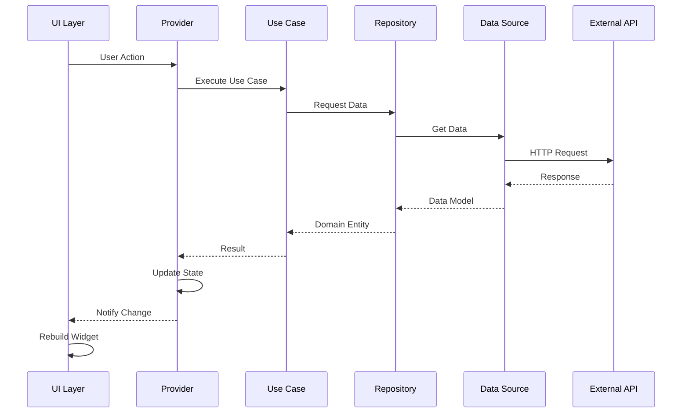

# 🏗 架构文档

本文档详细描述了 Star Trek 应用的技术架构、设计模式和核心组件。

## 📋 目录

- [架构概述](#架构概述)
- [分层架构](#分层架构)
- [设计模式](#设计模式)
- [状态管理](#状态管理)
- [数据流](#数据流)
- [模块化设计](#模块化设计)
- [性能优化](#性能优化)
- [安全架构](#安全架构)

## 🔍 架构概述

### 架构原则

1. **关注点分离**: 清晰的层次划分，每层职责单一
2. **依赖倒置**: 高层模块不依赖低层模块，都依赖抽象
3. **开闭原则**: 对扩展开放，对修改关闭
4. **单一职责**: 每个类和模块只有一个变化的理由
5. **可测试性**: 架构支持单元测试和集成测试

### 技术栈

```mermaid
graph TB
    A[Flutter Framework] --> B[Dart Language]
    A --> C[Material Design]
    A --> D[Cupertino Design]
    
    E[State Management] --> F[Provider/Riverpod]
    E --> G[BLoC Pattern]
    
    H[Data Layer] --> I[HTTP Client]
    H --> J[Local Storage]
    H --> K[Cache Management]
    
    L[Navigation] --> M[GoRouter]
    L --> N[Deep Linking]
    
    O[Testing] --> P[Unit Tests]
    O --> Q[Widget Tests]
    O --> R[Integration Tests]
    
    S[Theme System] --> T[AppColorScheme]
    S --> U[Material 3]
    S --> V[Multi-Theme Support]
```



### 🎨 主题系统架构

主题系统采用了模块化设计，支持多种星际主题：

- **AppColorScheme**: 自定义颜色方案枚举（避免与Flutter ColorScheme冲突）
- **ThemeManager**: 主题管理器，负责主题切换和持久化
- **多主题支持**: 星际舰队、企业号、克林贡、瓦肯、罗慕兰主题
- **Material 3**: 基于最新Material Design 3规范

## 🏛 分层架构

### Clean Architecture 实现

```
┌─────────────────────────────────────────────────────────┐
│                    Presentation Layer                   │
│  ┌─────────────┐  ┌─────────────┐  ┌─────────────┐     │
│  │    Pages    │  │   Widgets   │  │  Providers  │     │
│  └─────────────┘  └─────────────┘  └─────────────┘     │
└─────────────────────────────────────────────────────────┘
                              │
                              ▼
┌─────────────────────────────────────────────────────────┐
│                     Domain Layer                        │
│  ┌─────────────┐  ┌─────────────┐  ┌─────────────┐     │
│  │  Entities   │  │  Use Cases  │  │ Repositories│     │
│  │             │  │             │  │ (Abstract)  │     │
│  └─────────────┘  └─────────────┘  └─────────────┘     │
└─────────────────────────────────────────────────────────┘
                              │
                              ▼
┌─────────────────────────────────────────────────────────┐
│                      Data Layer                         │
│  ┌─────────────┐  ┌─────────────┐  ┌─────────────┐     │
│  │   Models    │  │ Data Sources│  │ Repositories│     │
│  │             │  │             │  │(Concrete)   │     │
│  └─────────────┘  └─────────────┘  └─────────────┘     │
└─────────────────────────────────────────────────────────┘
                              │
                              ▼
┌─────────────────────────────────────────────────────────┐
│                    External Layer                       │
│  ┌─────────────┐  ┌─────────────┐  ┌─────────────┐     │
│  │  Network    │  │   Storage   │  │   Devices   │     │
│  └─────────────┘  └─────────────┘  └─────────────┘     │
└─────────────────────────────────────────────────────────┘
```

### 层次职责

#### 1. Presentation Layer (表现层)

**职责**: UI 渲染、用户交互、状态展示

```dart
// lib/features/home/presentation/pages/home_page.dart
class HomePage extends StatelessWidget {
  const HomePage({super.key});
  
  @override
  Widget build(BuildContext context) {
    return Consumer<HomeProvider>(
      builder: (context, provider, child) {
        return Scaffold(
          body: _buildBody(context, provider),
        );
      },
    );
  }
  
  Widget _buildBody(BuildContext context, HomeProvider provider) {
    if (provider.isLoading) {
      return const LoadingWidget();
    }
    
    if (provider.hasError) {
      return ErrorWidget(error: provider.error);
    }
    
    return _buildContent(provider.userData);
  }
}
```

#### 2. Domain Layer (业务层)

**职责**: 业务逻辑、实体定义、用例实现

```dart
// lib/features/home/domain/entities/user_entity.dart
class UserEntity {
  final String id;
  final String name;
  final String email;
  final int level;
  final int experiencePoints;
  
  const UserEntity({
    required this.id,
    required this.name,
    required this.email,
    required this.level,
    required this.experiencePoints,
  });
}

// lib/features/home/domain/usecases/get_user_data_usecase.dart
class GetUserDataUseCase {
  final UserRepository repository;
  
  GetUserDataUseCase(this.repository);
  
  Future<Result<UserEntity>> call() async {
    try {
      final user = await repository.getCurrentUser();
      return Result.success(user);
    } catch (e) {
      return Result.failure(e.toString());
    }
  }
}
```

#### 3. Data Layer (数据层)

**职责**: 数据获取、缓存管理、数据转换

```dart
// lib/features/home/data/models/user_model.dart
class UserModel extends UserEntity {
  const UserModel({
    required super.id,
    required super.name,
    required super.email,
    required super.level,
    required super.experiencePoints,
  });
  
  factory UserModel.fromJson(Map<String, dynamic> json) {
    return UserModel(
      id: json['id'],
      name: json['name'],
      email: json['email'],
      level: json['level'],
      experiencePoints: json['experience_points'],
    );
  }
  
  Map<String, dynamic> toJson() {
    return {
      'id': id,
      'name': name,
      'email': email,
      'level': level,
      'experience_points': experiencePoints,
    };
  }
}

// lib/features/home/data/repositories/user_repository_impl.dart
class UserRepositoryImpl implements UserRepository {
  final UserRemoteDataSource remoteDataSource;
  final UserLocalDataSource localDataSource;
  final NetworkInfo networkInfo;
  
  UserRepositoryImpl({
    required this.remoteDataSource,
    required this.localDataSource,
    required this.networkInfo,
  });
  
  @override
  Future<UserEntity> getCurrentUser() async {
    if (await networkInfo.isConnected) {
      try {
        final remoteUser = await remoteDataSource.getCurrentUser();
        await localDataSource.cacheUser(remoteUser);
        return remoteUser;
      } catch (e) {
        return await localDataSource.getLastUser();
      }
    } else {
      return await localDataSource.getLastUser();
    }
  }
}
```

## 🎯 设计模式

### 1. Repository Pattern

```dart
// 抽象仓储接口
abstract class UserRepository {
  Future<UserEntity> getCurrentUser();
  Future<void> updateUser(UserEntity user);
  Future<List<UserEntity>> getUsers();
}

// 具体实现
class UserRepositoryImpl implements UserRepository {
  final UserRemoteDataSource _remoteDataSource;
  final UserLocalDataSource _localDataSource;
  
  UserRepositoryImpl(this._remoteDataSource, this._localDataSource);
  
  @override
  Future<UserEntity> getCurrentUser() async {
    // 实现缓存策略和网络请求逻辑
  }
}
```

### 2. Factory Pattern

```dart
// lib/core/di/injection_container.dart
class InjectionContainer {
  static final GetIt _getIt = GetIt.instance;
  
  static Future<void> init() async {
    // 注册数据源
    _getIt.registerLazySingleton<UserRemoteDataSource>(
      () => UserRemoteDataSourceImpl(_getIt()),
    );
    
    _getIt.registerLazySingleton<UserLocalDataSource>(
      () => UserLocalDataSourceImpl(_getIt()),
    );
    
    // 注册仓储
    _getIt.registerLazySingleton<UserRepository>(
      () => UserRepositoryImpl(
        remoteDataSource: _getIt(),
        localDataSource: _getIt(),
        networkInfo: _getIt(),
      ),
    );
    
    // 注册用例
    _getIt.registerLazySingleton(() => GetUserDataUseCase(_getIt()));
  }
  
  static T get<T extends Object>() => _getIt.get<T>();
}
```

### 3. Observer Pattern

```dart
// lib/core/events/app_event_bus.dart
class AppEventBus {
  static final _instance = AppEventBus._internal();
  factory AppEventBus() => _instance;
  AppEventBus._internal();
  
  final StreamController<AppEvent> _eventController = 
      StreamController<AppEvent>.broadcast();
  
  Stream<AppEvent> get events => _eventController.stream;
  
  void emit(AppEvent event) {
    _eventController.add(event);
  }
  
  void dispose() {
    _eventController.close();
  }
}

// 事件定义
abstract class AppEvent {}

class UserLoggedInEvent extends AppEvent {
  final UserEntity user;
  UserLoggedInEvent(this.user);
}

class LearningProgressUpdatedEvent extends AppEvent {
  final double progress;
  LearningProgressUpdatedEvent(this.progress);
}
```

### 4. Strategy Pattern

```dart
// lib/core/storage/storage_strategy.dart
abstract class StorageStrategy {
  Future<void> store(String key, dynamic value);
  Future<T?> retrieve<T>(String key);
  Future<void> remove(String key);
  Future<void> clear();
}

class SharedPreferencesStrategy implements StorageStrategy {
  final SharedPreferences _prefs;
  
  SharedPreferencesStrategy(this._prefs);
  
  @override
  Future<void> store(String key, dynamic value) async {
    if (value is String) {
      await _prefs.setString(key, value);
    } else if (value is int) {
      await _prefs.setInt(key, value);
    } else if (value is bool) {
      await _prefs.setBool(key, value);
    } else {
      await _prefs.setString(key, jsonEncode(value));
    }
  }
}

class SecureStorageStrategy implements StorageStrategy {
  final FlutterSecureStorage _storage;
  
  SecureStorageStrategy(this._storage);
  
  @override
  Future<void> store(String key, dynamic value) async {
    await _storage.write(key: key, value: jsonEncode(value));
  }
}
```

## 🔄 状态管理

### Provider 架构

```dart
// lib/features/home/presentation/providers/home_provider.dart
class HomeProvider extends ChangeNotifier {
  final GetUserDataUseCase _getUserDataUseCase;
  final GetLearningProgressUseCase _getLearningProgressUseCase;
  
  HomeProvider({
    required GetUserDataUseCase getUserDataUseCase,
    required GetLearningProgressUseCase getLearningProgressUseCase,
  }) : _getUserDataUseCase = getUserDataUseCase,
       _getLearningProgressUseCase = getLearningProgressUseCase;
  
  // 状态变量
  UserEntity? _userData;
  LearningProgressEntity? _learningProgress;
  bool _isLoading = false;
  String? _error;
  
  // Getters
  UserEntity? get userData => _userData;
  LearningProgressEntity? get learningProgress => _learningProgress;
  bool get isLoading => _isLoading;
  String? get error => _error;
  bool get hasError => _error != null;
  
  // 业务方法
  Future<void> loadUserData() async {
    _setLoading(true);
    _clearError();
    
    try {
      final result = await _getUserDataUseCase();
      result.fold(
        (failure) => _setError(failure.message),
        (user) => _setUserData(user),
      );
    } catch (e) {
      _setError(e.toString());
    } finally {
      _setLoading(false);
    }
  }
  
  Future<void> loadLearningProgress() async {
    try {
      final result = await _getLearningProgressUseCase();
      result.fold(
        (failure) => _setError(failure.message),
        (progress) => _setLearningProgress(progress),
      );
    } catch (e) {
      _setError(e.toString());
    }
  }
  
  // 私有方法
  void _setUserData(UserEntity user) {
    _userData = user;
    notifyListeners();
  }
  
  void _setLearningProgress(LearningProgressEntity progress) {
    _learningProgress = progress;
    notifyListeners();
  }
  
  void _setLoading(bool loading) {
    _isLoading = loading;
    notifyListeners();
  }
  
  void _setError(String error) {
    _error = error;
    notifyListeners();
  }
  
  void _clearError() {
    _error = null;
    notifyListeners();
  }
}
```

### 状态组合

```dart
// lib/core/providers/app_providers.dart
class AppProviders {
  static List<ChangeNotifierProvider> get providers => [
    ChangeNotifierProvider<ThemeProvider>(
      create: (_) => ThemeProvider(),
    ),
    ChangeNotifierProvider<AuthProvider>(
      create: (_) => AuthProvider(
        loginUseCase: InjectionContainer.get(),
        logoutUseCase: InjectionContainer.get(),
      ),
    ),
    ChangeNotifierProvider<HomeProvider>(
      create: (_) => HomeProvider(
        getUserDataUseCase: InjectionContainer.get(),
        getLearningProgressUseCase: InjectionContainer.get(),
      ),
    ),
  ];
  
  static List<ProxyProvider> get proxyProviders => [
    ProxyProvider<AuthProvider, NavigationProvider>(
      update: (_, auth, __) => NavigationProvider(auth),
    ),
  ];
}
```

## 📊 数据流

### 数据流向图



### 缓存策略

```dart
// lib/core/cache/cache_manager.dart
class CacheManager {
  final Map<String, CacheEntry> _cache = {};
  final Duration _defaultTtl = const Duration(minutes: 30);
  
  void put<T>(String key, T data, {Duration? ttl}) {
    final expiry = DateTime.now().add(ttl ?? _defaultTtl);
    _cache[key] = CacheEntry(data, expiry);
  }
  
  T? get<T>(String key) {
    final entry = _cache[key];
    if (entry == null || entry.isExpired) {
      _cache.remove(key);
      return null;
    }
    return entry.data as T;
  }
  
  void invalidate(String key) {
    _cache.remove(key);
  }
  
  void clear() {
    _cache.clear();
  }
}

class CacheEntry {
  final dynamic data;
  final DateTime expiry;
  
  CacheEntry(this.data, this.expiry);
  
  bool get isExpired => DateTime.now().isAfter(expiry);
}
```

## 🧩 模块化设计

### 功能模块结构

```
features/
├── auth/                    # 认证模块
│   ├── data/
│   ├── domain/
│   └── presentation/
├── home/                    # 首页模块
│   ├── data/
│   ├── domain/
│   ├── presentation/
│   └── injection_container.dart  # 依赖注入配置
├── learning/                # 学习模块
│   ├── data/
│   ├── domain/
│   ├── presentation/
│   └── injection_container.dart  # 依赖注入配置
├── profile/                 # 个人资料模块
│   ├── data/
│   ├── domain/
│   └── presentation/
└── challenges/              # 挑战模块
    ├── data/
    ├── domain/
    └── presentation/
```

### 模块依赖注入

每个功能模块都有独立的依赖注入配置文件，确保模块间的解耦和可测试性。

#### Home模块依赖注入示例

```dart
// lib/features/home/injection_container.dart
final sl = GetIt.instance;

/// 初始化主页功能的依赖注入
Future<void> initHomeDependencies() async {
  // ==================== Data Sources ====================
  
  // Local Data Source
  sl.registerLazySingleton<HomeLocalDataSource>(
    () => HomeLocalDataSourceImpl(),
  );
  
  // Remote Data Source
  sl.registerLazySingleton<HomeRemoteDataSource>(
    () => HomeRemoteDataSourceImpl(),
  );
  
  // ==================== Repository ====================
  
  sl.registerLazySingleton<HomeRepository>(
    () => HomeRepositoryImpl(
      localDataSource: sl(),
      remoteDataSource: sl(),
    ),
  );
  
  // ==================== Use Cases ====================
  
  sl.registerLazySingleton(() => GetHomeDataUseCase(sl()));
  sl.registerLazySingleton(() => GetUserStatsUseCase(sl()));
  sl.registerLazySingleton(() => GetNotificationsUseCase(sl()));
  sl.registerLazySingleton(() => MarkNotificationReadUseCase(sl()));
  sl.registerLazySingleton(() => RefreshHomeDataUseCase(sl()));
  
  // ==================== Bloc ====================
  
  sl.registerFactory(() => HomeBloc(
    getHomeDataUseCase: sl(),
    getUserStatsUseCase: sl(),
    getNotificationsUseCase: sl(),
    markNotificationReadUseCase: sl(),
    refreshHomeDataUseCase: sl(),
  ));
}
```

#### 主应用中的依赖注入初始化

```dart
// lib/main.dart
import 'features/learning/injection_container.dart' as learning_di;
import 'features/home/injection_container.dart' as home_di;

void main() async {
  // 初始化依赖注入
  await learning_di.initLearningDependencies();
  await home_di.initHomeDependencies();
  
  runApp(const StartTrekApp());
}

// MultiBlocProvider配置
MultiBlocProvider(
  providers: [
    BlocProvider<LearningBloc>(
      create: (context) => GetIt.instance<LearningBloc>(),
    ),
    BlocProvider<HomeBloc>(
      create: (context) => GetIt.instance<HomeBloc>(),
    ),
  ],
  child: MaterialApp.router(...),
)
```

### 模块间通信

```dart
// lib/core/communication/module_communication.dart
abstract class ModuleCommunication {
  void sendMessage(String module, Map<String, dynamic> data);
  Stream<ModuleMessage> get messages;
}

class ModuleMessage {
  final String fromModule;
  final String toModule;
  final String type;
  final Map<String, dynamic> data;
  final DateTime timestamp;
  
  ModuleMessage({
    required this.fromModule,
    required this.toModule,
    required this.type,
    required this.data,
    required this.timestamp,
  });
}

class EventBusModuleCommunication implements ModuleCommunication {
  final StreamController<ModuleMessage> _controller = 
      StreamController<ModuleMessage>.broadcast();
  
  @override
  void sendMessage(String module, Map<String, dynamic> data) {
    final message = ModuleMessage(
      fromModule: 'current_module',
      toModule: module,
      type: data['type'] ?? 'unknown',
      data: data,
      timestamp: DateTime.now(),
    );
    _controller.add(message);
  }
  
  @override
  Stream<ModuleMessage> get messages => _controller.stream;
}
```

## ⚡ 性能优化

### Widget 优化

```dart
// lib/shared/widgets/optimized_list_view.dart
class OptimizedListView<T> extends StatelessWidget {
  final List<T> items;
  final Widget Function(BuildContext, T, int) itemBuilder;
  final bool shrinkWrap;
  final ScrollPhysics? physics;
  
  const OptimizedListView({
    super.key,
    required this.items,
    required this.itemBuilder,
    this.shrinkWrap = false,
    this.physics,
  });
  
  @override
  Widget build(BuildContext context) {
    return ListView.builder(
      itemCount: items.length,
      shrinkWrap: shrinkWrap,
      physics: physics,
      cacheExtent: 1000, // 预缓存范围
      itemBuilder: (context, index) {
        final item = items[index];
        return RepaintBoundary(
          child: itemBuilder(context, item, index),
        );
      },
    );
  }
}
```

### 图片优化

```dart
// lib/shared/widgets/optimized_image.dart
class OptimizedImage extends StatelessWidget {
  final String imageUrl;
  final double? width;
  final double? height;
  final BoxFit fit;
  
  const OptimizedImage({
    super.key,
    required this.imageUrl,
    this.width,
    this.height,
    this.fit = BoxFit.cover,
  });
  
  @override
  Widget build(BuildContext context) {
    return CachedNetworkImage(
      imageUrl: imageUrl,
      width: width,
      height: height,
      fit: fit,
      placeholder: (context, url) => const ShimmerPlaceholder(),
      errorWidget: (context, url, error) => const ErrorPlaceholder(),
      memCacheWidth: width?.toInt(),
      memCacheHeight: height?.toInt(),
      maxWidthDiskCache: 1000,
      maxHeightDiskCache: 1000,
    );
  }
}
```

### 内存管理

```dart
// lib/core/memory/memory_manager.dart
class MemoryManager {
  static final Map<String, Timer> _timers = {};
  
  static void scheduleCleanup(String key, Duration delay, VoidCallback cleanup) {
    _timers[key]?.cancel();
    _timers[key] = Timer(delay, () {
      cleanup();
      _timers.remove(key);
    });
  }
  
  static void cancelCleanup(String key) {
    _timers[key]?.cancel();
    _timers.remove(key);
  }
  
  static void clearAllTimers() {
    for (final timer in _timers.values) {
      timer.cancel();
    }
    _timers.clear();
  }
}
```

## 🔒 安全架构

### 数据加密

```dart
// lib/core/security/encryption_service.dart
class EncryptionService {
  static const String _algorithm = 'AES';
  static final Encrypt _encrypt = Encrypt(AES(Key.fromSecureRandom(32)));
  
  static String encryptData(String plainText) {
    final encrypted = _encrypt.encrypt(plainText, iv: IV.fromSecureRandom(16));
    return encrypted.base64;
  }
  
  static String decryptData(String encryptedText) {
    final encrypted = Encrypted.fromBase64(encryptedText);
    return _encrypt.decrypt(encrypted, iv: IV.fromSecureRandom(16));
  }
}
```

### 网络安全

```dart
// lib/core/network/secure_http_client.dart
class SecureHttpClient {
  static Dio createSecureClient() {
    final dio = Dio();
    
    // 添加拦截器
    dio.interceptors.addAll([
      AuthInterceptor(),
      LoggingInterceptor(),
      ErrorInterceptor(),
    ]);
    
    // 配置证书固定
    (dio.httpClientAdapter as DefaultHttpClientAdapter).onHttpClientCreate = (client) {
      client.badCertificateCallback = (cert, host, port) {
        return _validateCertificate(cert, host);
      };
      return client;
    };
    
    return dio;
  }
  
  static bool _validateCertificate(X509Certificate cert, String host) {
    // 实现证书验证逻辑
    return true;
  }
}
```

### 权限管理

```dart
// lib/core/permissions/permission_manager.dart
class PermissionManager {
  static Future<bool> requestPermission(Permission permission) async {
    final status = await permission.status;
    
    if (status.isGranted) {
      return true;
    }
    
    if (status.isDenied) {
      final result = await permission.request();
      return result.isGranted;
    }
    
    if (status.isPermanentlyDenied) {
      await openAppSettings();
      return false;
    }
    
    return false;
  }
  
  static Future<Map<Permission, PermissionStatus>> requestMultiplePermissions(
    List<Permission> permissions,
  ) async {
    return await permissions.request();
  }
}
```

## 📈 可扩展性设计

### 插件架构

```dart
// lib/core/plugins/plugin_manager.dart
abstract class AppPlugin {
  String get name;
  String get version;
  Future<void> initialize();
  Future<void> dispose();
}

class PluginManager {
  final List<AppPlugin> _plugins = [];
  
  void registerPlugin(AppPlugin plugin) {
    _plugins.add(plugin);
  }
  
  Future<void> initializeAllPlugins() async {
    for (final plugin in _plugins) {
      await plugin.initialize();
    }
  }
  
  Future<void> disposeAllPlugins() async {
    for (final plugin in _plugins) {
      await plugin.dispose();
    }
  }
  
  T? getPlugin<T extends AppPlugin>() {
    return _plugins.whereType<T>().firstOrNull;
  }
}
```

### 配置管理

```dart
// lib/core/config/config_manager.dart
class ConfigManager {
  static final Map<String, dynamic> _config = {};
  
  static Future<void> loadConfig() async {
    final configFile = await rootBundle.loadString('assets/config/app_config.json');
    _config.addAll(jsonDecode(configFile));
  }
  
  static T getValue<T>(String key, {T? defaultValue}) {
    return _config[key] as T? ?? defaultValue as T;
  }
  
  static void setValue(String key, dynamic value) {
    _config[key] = value;
  }
  
  static bool getBool(String key, {bool defaultValue = false}) {
    return getValue<bool>(key, defaultValue: defaultValue);
  }
  
  static String getString(String key, {String defaultValue = ''}) {
    return getValue<String>(key, defaultValue: defaultValue);
  }
  
  static int getInt(String key, {int defaultValue = 0}) {
    return getValue<int>(key, defaultValue: defaultValue);
  }
}
```

---

📝 **注意**: 本架构文档会随着项目演进持续更新，请定期查看最新版本以了解架构变更。