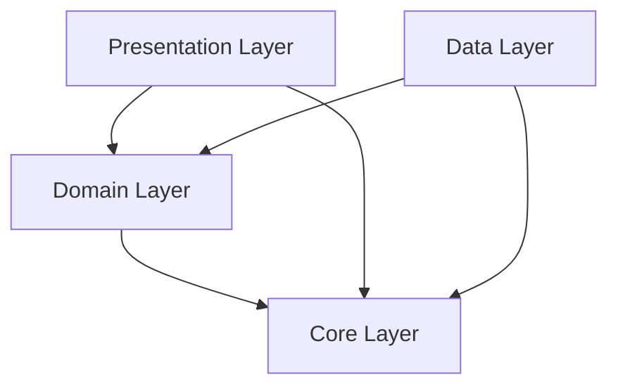

# 开发指南

本文档提供了 Star Trek 项目的详细开发指南，帮助开发者快速上手并遵循项目规范。

## 📋 目录

- [开发环境设置](#开发环境设置)
- [项目架构](#项目架构)
- [编码规范](#编码规范)
- [代码质量](#代码质量)
- [Git 工作流](#git-工作流)
- [测试策略](#测试策略)
- [性能优化](#性能优化)
- [调试技巧](#调试技巧)
- [最新修复记录](#最新修复记录)

## 🔧 开发环境设置

### 必需工具

1. **Flutter SDK**
   ```bash
   # 检查 Flutter 版本
   flutter --version
   
   # 应该显示 >= 3.0.0
   ```

2. **IDE 推荐**
   - **VS Code** + Flutter 扩展
   - **Android Studio** + Flutter 插件
   - **IntelliJ IDEA** + Dart/Flutter 插件

3. **代码格式化**
   ```bash
   # 格式化代码
   dart format .
   
   # 分析代码
   dart analyze
   ```

### VS Code 配置

创建 `.vscode/settings.json`：

```json
{
  "dart.flutterSdkPath": "/path/to/flutter",
  "editor.formatOnSave": true,
  "editor.codeActionsOnSave": {
    "source.fixAll": true
  },
  "dart.lineLength": 80,
  "dart.insertArgumentPlaceholders": false
}
```

## 🏗️ 项目架构

### Clean Architecture 分层

```
lib/
├── core/                          # 核心功能层
│   ├── error/                     # 错误处理
│   │   └── failures.dart          # 失败类型定义
│   ├── usecases/                  # 基础用例
│   │   └── usecase.dart           # UseCase抽象类
│   ├── utils/                     # 工具函数
│   └── widgets/                   # 通用组件
├── features/                      # 功能模块
│   └── [feature_name]/           # 具体功能
│       ├── data/                 # 数据层
│       │   ├── datasources/      # 数据源
│       │   ├── models/           # 数据模型
│       │   └── repositories/     # 仓储实现
│       ├── domain/               # 业务层
│       │   ├── entities/         # 业务实体
│       │   ├── repositories/     # 仓储接口
│       │   └── usecases/         # 用例
│       └── presentation/         # 表现层
│           ├── bloc/             # 状态管理
│           ├── pages/            # 页面
│           └── widgets/          # 组件
└── main.dart                     # 应用入口
```

### 依赖关系



## 📝 编码规范

### 命名规范

1. **文件和目录**: `snake_case`
   ```
   learning_repository_impl.dart
   get_lessons_usecase.dart
   ```

2. **类名**: `PascalCase`
   ```dart
   class LearningRepositoryImpl
   class GetLessonsUseCase
   ```

3. **变量和方法**: `camelCase`
   ```dart
   final userProgress = 0.75;
   void updateLessonProgress() {}
   ```

4. **常量**: `lowerCamelCase`
   ```dart
   const maxRetryAttempts = 3;
   ```

### 代码结构

1. **导入顺序**
   ```dart
   // Dart 核心库
   import 'dart:async';
   
   // Flutter 框架
   import 'package:flutter/material.dart';
   
   // 第三方包
   import 'package:dartz/dartz.dart';
   import 'package:equatable/equatable.dart';
   
   // 项目内部导入
   import '../../../core/error/failures.dart';
   import '../entities/lesson.dart';
   ```

2. **类结构**
   ```dart
   class ExampleClass {
     // 1. 静态常量
     static const String defaultValue = 'default';
     
     // 2. 实例变量
     final String title;
     final int count;
     
     // 3. 构造函数
     const ExampleClass({
       required this.title,
       required this.count,
     });
     
     // 4. 公共方法
     void publicMethod() {}
     
     // 5. 私有方法
     void _privateMethod() {}
   }
   ```

## 🔍 代码质量

### 静态分析配置

`analysis_options.yaml` 配置：

```yaml
include: package:flutter_lints/flutter.yaml

linter:
  rules:
    # 启用额外规则
    prefer_const_constructors: true
    prefer_const_literals_to_create_immutables: true
    avoid_print: true
    avoid_unnecessary_containers: true
    
    # 禁用某些规则
    file_names: false

analyzer:
  exclude:
    - "**/*.g.dart"
    - "**/*.freezed.dart"
  
  errors:
    # 将警告视为错误
    unused_import: error
    dead_code: error
```

### 代码质量检查

```bash
# 运行静态分析
flutter analyze

# 检查代码格式
dart format --set-exit-if-changed .

# 运行所有测试
flutter test

# 生成测试覆盖率
flutter test --coverage
```

### 最新代码质量修复

#### 🔧 已修复的问题

1. **返回类型错误修复**
   ```dart
   // 修复前
   Future<List<Lesson>> searchLessons() {
     return lessonsResult; // 类型不匹配
   }
   
   // 修复后
   Future<Either<Failure, List<Lesson>>> searchLessons() {
     return lessonsResult.fold(
       (failure) => Left(failure),
       (lessons) => Right(lessons),
     );
   }
   ```

2. **文档注释HTML标签修复**
   ```dart
   // 修复前
   /// 返回 Either<Failure, Type> 表示成功或失败
   
   // 修复后
   /// 返回 `Either<Failure, Type>` 表示成功或失败
   ```

3. **未使用导入清理**
   ```dart
   // 修复前
   import 'package:dartz/dartz.dart'; // 未使用
   import '../entities/lesson.dart';
   
   // 修复后
   import '../entities/lesson.dart';
   ```

4. **废弃API替换**
   ```dart
   // 修复前
   final semanticsOwner = tester.binding.pipelineOwner.semanticsOwner;
   
   // 修复后
   final semanticsEnabled = SemanticsBinding.instance.semanticsEnabled;
   ```

## 🔄 Git 工作流

### 分支策略

```
main                    # 主分支，生产环境代码
├── develop            # 开发分支
│   ├── feature/xxx    # 功能分支
│   ├── bugfix/xxx     # 修复分支
│   └── hotfix/xxx     # 热修复分支
```

### 提交规范

使用 [Conventional Commits](https://www.conventionalcommits.org/) 规范：

```
<type>[optional scope]: <description>

[optional body]

[optional footer(s)]
```

**类型说明：**
- `feat`: 新功能
- `fix`: 修复bug
- `docs`: 文档更新
- `style`: 代码格式调整
- `refactor`: 重构
- `test`: 测试相关
- `chore`: 构建过程或辅助工具的变动

**示例：**
```bash
git commit -m "feat(learning): 添加课程搜索功能"
git commit -m "fix(home): 修复导航栏跳转问题"
git commit -m "docs: 更新开发指南"
```

### 代码提交流程

```bash
# 1. 创建功能分支
git checkout -b feature/lesson-search

# 2. 开发功能
# ... 编写代码 ...

# 3. 代码质量检查
flutter analyze
flutter test
dart format .

# 4. 提交代码
git add .
git commit -m "feat(learning): 实现课程搜索功能"

# 5. 推送分支
git push origin feature/lesson-search

# 6. 创建 Pull Request
```

## 🧪 测试策略

### 测试金字塔

```
        /\     E2E Tests (少量)
       /  \    
      /____\   Integration Tests (适量)
     /      \  
    /________\ Unit Tests (大量)
```

### 单元测试

```dart
// test/features/learning/domain/usecases/get_lessons_usecase_test.dart
import 'package:flutter_test/flutter_test.dart';
import 'package:mockito/mockito.dart';
import 'package:dartz/dartz.dart';

void main() {
  group('GetLessonsUseCase', () {
    late GetLessonsUseCase usecase;
    late MockLearningRepository mockRepository;

    setUp(() {
      mockRepository = MockLearningRepository();
      usecase = GetLessonsUseCase(mockRepository);
    });

    test('should get lessons from repository', () async {
      // arrange
      final tLessons = [Lesson(id: '1', title: 'Test')];
      when(mockRepository.getLessons())
          .thenAnswer((_) async => Right(tLessons));

      // act
      final result = await usecase(NoParams());

      // assert
      expect(result, Right(tLessons));
      verify(mockRepository.getLessons());
      verifyNoMoreInteractions(mockRepository);
    });
  });
}
```

### 组件测试

```dart
// test/features/learning/presentation/widgets/lesson_card_test.dart
import 'package:flutter/material.dart';
import 'package:flutter_test/flutter_test.dart';

void main() {
  group('LessonCard', () {
    testWidgets('should display lesson title', (tester) async {
      // arrange
      const lesson = Lesson(id: '1', title: 'Test Lesson');
      
      // act
      await tester.pumpWidget(
        MaterialApp(
          home: Scaffold(
            body: LessonCard(lesson: lesson),
          ),
        ),
      );
      
      // assert
      expect(find.text('Test Lesson'), findsOneWidget);
    });
  });
}
```

### 集成测试

```dart
// integration_test/app_test.dart
import 'package:flutter/material.dart';
import 'package:flutter_test/flutter_test.dart';
import 'package:integration_test/integration_test.dart';

import 'package:star_trek/main.dart' as app;

void main() {
  IntegrationTestWidgetsFlutterBinding.ensureInitialized();

  group('App Integration Tests', () {
    testWidgets('complete user flow test', (tester) async {
      app.main();
      await tester.pumpAndSettle();

      // 测试导航
      await tester.tap(find.byIcon(Icons.school));
      await tester.pumpAndSettle();

      // 验证页面跳转
      expect(find.text('学习'), findsOneWidget);
    });
  });
}
```

## ⚡ 性能优化

### 构建优化

1. **使用 const 构造函数**
   ```dart
   // 好的做法
   const Text('Hello World')
   const SizedBox(height: 16)
   
   // 避免
   Text('Hello World')
   SizedBox(height: 16)
   ```

2. **避免不必要的重建**
   ```dart
   // 使用 BlocBuilder 的 buildWhen
   BlocBuilder<LearningBloc, LearningState>(
     buildWhen: (previous, current) => 
         previous.lessons != current.lessons,
     builder: (context, state) => LessonList(lessons: state.lessons),
   )
   ```

3. **列表优化**
   ```dart
   // 使用 ListView.builder 而不是 ListView
   ListView.builder(
     itemCount: lessons.length,
     itemBuilder: (context, index) => LessonCard(lesson: lessons[index]),
   )
   ```

### 内存优化

1. **及时释放资源**
   ```dart
   class _LearningPageState extends State<LearningPage> {
     late StreamSubscription _subscription;
     
     @override
     void dispose() {
       _subscription.cancel();
       super.dispose();
     }
   }
   ```

2. **使用弱引用**
   ```dart
   // 避免循环引用
   class LearningBloc {
     WeakReference<BuildContext>? _contextRef;
     
     void setContext(BuildContext context) {
       _contextRef = WeakReference(context);
     }
   }
   ```

## 🐛 调试技巧

### Flutter Inspector

1. **启用 Inspector**
   ```bash
   flutter run --debug
   ```

2. **常用调试命令**
   ```bash
   # 热重载
   r
   
   # 热重启
   R
   
   # 切换性能叠加层
   p
   
   # 切换组件边界显示
   w
   ```

### 日志调试

```dart
import 'dart:developer' as developer;

// 使用 log 而不是 print
developer.log('Debug message', name: 'LearningBloc');

// 条件日志
assert(() {
  developer.log('Debug only message');
  return true;
}());
```

### BLoC 调试

```dart
class SimpleBlocObserver extends BlocObserver {
  @override
  void onEvent(BlocBase bloc, Object? event) {
    super.onEvent(bloc, event);
    developer.log('Event: $event', name: bloc.runtimeType.toString());
  }

  @override
  void onTransition(BlocBase bloc, Transition transition) {
    super.onTransition(bloc, transition);
    developer.log('Transition: $transition', name: bloc.runtimeType.toString());
  }

  @override
  void onError(BlocBase bloc, Object error, StackTrace stackTrace) {
    super.onError(bloc, error, stackTrace);
    developer.log('Error: $error', name: bloc.runtimeType.toString(), error: error, stackTrace: stackTrace);
  }
}
```

## 🔧 最新修复记录

### 2024-12-19 代码质量全面提升

#### 修复的文件和问题

1. **lib/features/learning/data/repositories/learning_repository_impl.dart**
   - 修复返回类型不匹配问题
   - 统一使用 `Either<Failure, Type>` 模式
   - 改进错误处理逻辑

2. **lib/core/usecases/usecase.dart**
   - 修复文档注释中的HTML标签问题
   - 所有泛型类型使用反引号包围
   - 统一文档注释格式

3. **lib/core/error/failures.dart**
   - 修复悬空库文档注释问题
   - 优化错误类型定义
   - 完善错误信息处理

4. **lib/features/learning/domain/usecases/search_lessons_usecase.dart**
   - 移除未使用的导入语句
   - 清理代码依赖关系

5. **integration_test/app_test.dart**
   - 替换废弃的API调用
   - 更新Flutter 3.x兼容的语义API
   - 修复测试兼容性问题

#### 质量改进措施

1. **静态分析通过**
   - 所有 `flutter analyze` 警告已修复
   - 代码符合 Dart 和 Flutter 最佳实践
   - 类型安全得到加强

2. **文档规范化**
   - 统一文档注释格式
   - 泛型类型正确使用反引号
   - 移除HTML标签警告

3. **API兼容性**
   - 更新废弃API的使用
   - 确保Flutter 3.x兼容性
   - 优化测试代码

#### 开发流程改进

1. **代码提交前检查清单**
   ```bash
   # 必须通过的检查
   flutter analyze          # 静态分析
   dart format --set-exit-if-changed .  # 代码格式
   flutter test            # 单元测试
   ```

2. **CI/CD 集成**
   - 自动运行静态分析
   - 强制代码格式检查
   - 测试覆盖率要求

3. **代码审查标准**
   - 确保类型安全
   - 检查错误处理
   - 验证文档完整性
   - 测试覆盖率要求

## 📚 参考资源

- [Flutter 官方文档](https://flutter.dev/docs)
- [Dart 语言指南](https://dart.dev/guides)
- [Clean Architecture](https://blog.cleancoder.com/uncle-bob/2012/08/13/the-clean-architecture.html)
- [BLoC 模式](https://bloclibrary.dev/)
- [Effective Dart](https://dart.dev/guides/language/effective-dart)

---

💡 **提示**: 遇到问题时，首先检查 `flutter doctor` 和 `flutter analyze` 的输出，大多数问题都能通过这些工具快速定位。